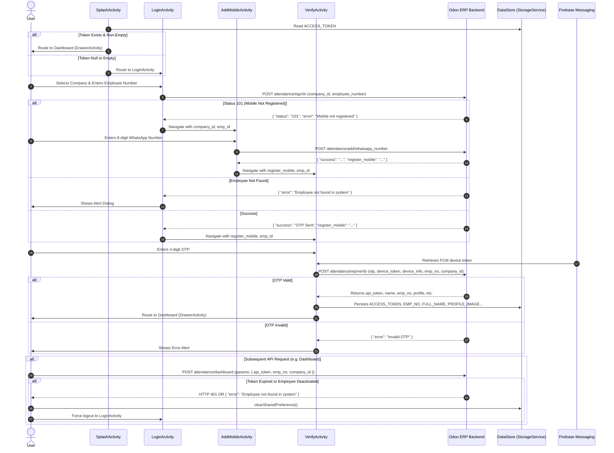

# Complete Native App → Flutter Migration & API Integration Report

**Target App:** Al Sharqi Holding Self Service App (`com.selfservice.app`)  
**Native Source Codebase:** `D:\selfservice-webview-new_updates_nov_2024`  
**Flutter Target Workspace:** `C:\Users\Shaheer\Documents\GitHub\Sharqi-App`  
**Backend Host:** `https://erp.alsharqiholding.qa`  
**Audit Date:** September 2026  
**Auditor:** Antigravity AI Engineering Pair  

---

## 1. Executive Summary

This report delivers a 100% code-level technical audit of the native Android application **Self Service** (`com.selfservice.app`, version `1.0.4`, build `5`), developed for **Al Sharqi Holding**, to facilitate an exact functional and architectural migration to **Flutter / Dart**.

### Native App Architecture
* **Language & Framework:** Kotlin 1.7.0, Android SDK target 34 (Android 14), min SDK 21 (Android 5.0 Lollipop).
* **Architecture Pattern:** MVVM (Model-View-ViewModel) with Android Architecture Components (`ViewModel`, `LiveData`, Android DataBinding).
* **Dependency Injection:** Dagger-Hilt (`@HiltAndroidApp`, `@HiltViewModel`, `@AndroidEntryPoint`, `NetworkModule`).
* **Networking:** Retrofit 2.9.0 with Gson Converter Factory, OkHttpClient 4.9.3 (timeouts set to 60 seconds), `HttpLoggingInterceptor`.
* **Asynchronous Execution:** Kotlin Coroutines (`viewModelScope`, `Dispatchers.IO`) alongside RxJava 2 / RxBus event messaging.
* **Local Storage:** Android Jetpack DataStore Preferences (`USER_PREFERENCES_NAME = "self_service"`).
* **Location Services:** Google Play Services Location (`FusedLocationProviderClient`, `LocationRequest.PRIORITY_HIGH_ACCURACY`).
* **Push Notifications:** Firebase Cloud Messaging (`com.google.firebase:firebase-messaging:23.1.1`) with custom Notification Channel `SelfServiceChannel`.
* **Image Handling:** Glide 4.9.0, Android Base64 utility for base64-encoded profile pictures.
* **Embedded Web View:** Android WebKit WebView with HTML5 DOM storage, JavaScript execution, and `WebChromeClient.onShowFileChooser` file upload handler.

### Backend Infrastructure
* **ERP System:** Odoo ERP Backend (`https://erp.alsharqiholding.qa/alsharqi/`).
* **Protocol Convention:** Odoo JSON-RPC 2.0 payload format wrapped over standard HTTP `POST`.
  * **Requests** encapsulate parameters inside a top-level `params` object: `{"params": { ... }}` or `{"params": ""}`.
  * **Responses** encapsulate results inside a top-level `result` object: `{"jsonrpc": "2.0", "id": null, "result": { ... }}`.
  * **Odoo Data Nuance:** Odoo returns boolean `false` when string or object fields are null/empty (e.g., `phone: false`, `profile: false`, `code: false`). Dart models must explicitly handle `dynamic` or check `value is String ? value : ''`.
* **Authentication Mechanism:** The native app does **NOT** authenticate via an HTTP `Authorization: Bearer <token>` header (this was commented out in `NetworkModule.kt`). Instead, authentication is performed by passing `"api_token": "<token>"` directly inside the JSON request payload under `params`.

---

## 2. Complete App Feature Inventory

| Screen / Feature | API Used | Admin Portal Dep. | Local Storage Dep. | Static Data | Auth Required | Native Source Files |
| :--- | :--- | :--- | :--- | :--- | :--- | :--- |
| **Splash Screen** | None | None | Reads `ACCESS_TOKEN` | App icon, 3s timer | No | `SplashActivity.kt`, `SplashViewModel.kt`, `SplashNavigator.kt` |
| **Login / Company Selection** | `POST company/list`<br>`POST attendance/sign/in` | Company master list, employee status | None | UI labels, dialog styling | No | `LoginActivity.kt`, `LoginViewModel.kt`, `SelectCompanyAdapter.kt`, `CompanyItem.kt` |
| **Register / Add WhatsApp** | `POST attendance/add/whatsapp_number` | Employee phone record | Reads/Writes `COMPANY_ID` | UI text, 8-digit min length | No | `AddMobileActivity.kt`, `AddMobileViewModel.kt` |
| **OTP Verification** | `POST attendance/sign/in` (resend)<br>`POST attendance/otp/verify` | OTP validation, token issuing, user profile | Writes `EMP_ID`, `FULL_NAME`, `EMP_NO`, `PHONE`, `EMAIL`, `COMPANY_NAME`, `ACCESS_TOKEN`, `PROFILE_IMAGE`, `WHATS_APP_PHONE` | 30s countdown timer | No (Produces Auth) | `VerifyActivity.kt`, `VerifyViewModel.kt` |
| **Dashboard / Home** | `POST attendance/dashboard` | Employee profile, contracts, manager, residency | Reads `FULL_NAME`, `PHONE`, `PROFILE_IMAGE`, `EMP_NO`, `COMPANY_ID`, `ACCESS_TOKEN` | Grid card labels | Yes | `DrawerActivity.kt`, `HomeFragment.kt`, `HomeVM.kt`, `HomeAdapter.kt`, `HomeItem.kt` |
| **Record Time In** | `POST attendance/check_time_in_out`<br>`POST plan/location/today`<br>`POST location/update/list`<br>`POST attendance/check/in`<br>`POST attendance/update_area` | Allowed locations, attendance schedules, geofence | Reads `EMP_NO`, `COMPANY_ID`, `ACCESS_TOKEN`, `FULL_NAME`, `PHONE`, `PROFILE_IMAGE` | Radio attendance types (Present, Sick, Day Off, Absent, Stop Work, Cancel Day Off) | Yes | `RecordTimeFragment.kt`, `RecordTimeVM.kt`, `SelectWorkLocationAdapter.kt`, `WorkLocationItem.kt` |
| **Record Time Out** | `POST attendance/check_time_in_out`<br>`POST attendance/check/out` | Attendance validation, time calculation | Reads `EMP_NO`, `COMPANY_ID`, `ACCESS_TOKEN`, `FULL_NAME`, `PHONE`, `PROFILE_IMAGE` | 2-hour early checkout threshold reason dialog | Yes | `RecordTimeFragment.kt`, `RecordTimeVM.kt` |
| **Attendance List** | `POST attendance/list` | Verified attendance logs, overtime approval | Reads `EMP_NO`, `COMPANY_ID`, `ACCESS_TOKEN` | Table column headers (`Date`, `Status`, `Time-In`, `Time-Out`, `Hours`, `OT`, `Approved`) | Yes | `NewAttendanceListFragment.kt`, `NewAttendanceListVM.kt`, `TableViewAdapter.kt`, `AttendanceItemNew.kt` |
| **Work Plan** | `POST employee/work_plan` | Shift assignments, scheduled locations, work hours | Reads `EMP_NO`, `COMPANY_ID`, `ACCESS_TOKEN` | Table headers (`Date`, `Location`, `Area`, `Work Status`, `Work From`, `Work To`, `Total`, `O.T.`) | Yes | `WorkPlanListFragment.kt`, `WorkPlanListVM.kt`, `WorkPlanAdapter.kt`, `WorkPlanItem.kt` |
| **Notification Logs** | `POST notification/logs` | Push notification dispatch records, HR announcements | Reads `EMP_NO`, `COMPANY_ID`, `ACCESS_TOKEN` | Empty state text | Yes | `NotificationListFragment.kt`, `NotificationListVM.kt`, `NotificationAdapter.kt`, `NotificationItem.kt` |
| **Notification Details** | None (Intent Parcelable) | Attachment storage | None | Fallback title, layout | Yes | `NotificationDetailsActivity.kt`, `NotificationDetailsViewModel.kt` |
| **Self Service Web Portal** | Web URL: `https://erp.alsharqiholding.qa/self/service` | Web self-service portal (Leaves, Complaints, Requests, Ideas) | Session cookies via Android WebKit | Base Web Portal URL | Yes (Cookie / Web Session) | `SelfServiceWebFragment.kt`, `SelfServiceWebVM.kt` |
| **Navigation Drawer** | None (Local Logout) | Session revocation | Clears entire DataStore; deletes FCM token | Menu labels, app version | Yes | `DrawerActivity.kt`, `DrawerVM.kt` |

---

## 3. Screen-by-Screen Analysis

### 3.1 Splash Screen
* **Native Files:** `SplashActivity.kt`, `SplashViewModel.kt`, `SplashNavigator.kt`, `activity_splash.xml`.
* **Navigation Path:** App launch launcher activity → `LoginActivity` or `DrawerActivity`.
* **Purpose:** Initial runtime permission validation and authentication routing.
* **Permissions Checked:**
  * Android 13+ (`SDK >= 33`): `READ_MEDIA_IMAGES`, `ACCESS_FINE_LOCATION`, `ACCESS_COARSE_LOCATION`, `POST_NOTIFICATIONS`.
  * Android < 13: `READ_EXTERNAL_STORAGE`, `ACCESS_FINE_LOCATION`, `ACCESS_COARSE_LOCATION`, `POST_NOTIFICATIONS`.
  * If denied with rationale, requests permissions. If permanently denied, directs to `Settings.ACTION_APPLICATION_DETAILS_SETTINGS`.
* **Timer & Auth Logic:**
  * Displays splash logo for 3,000ms (`Handler(Looper.getMainLooper()).postDelayed(..., 3000)`).
  * Evaluates `SelfServicePreference.getValue(PreferenceKeys.ACCESS_TOKEN)`.
  * If token is null or empty string: routes to `LoginActivity`.
  * If token exists: routes to `DrawerActivity` and finishes affinity.
* **FCM Registration:** Invokes `FirebaseMessaging.getInstance().token` in `BaseActivity.onCreate()`, storing the token into `PreferenceKeys.DEVICE_ID`.

### 3.2 Login / Company Selection Screen
* **Native Files:** `LoginActivity.kt`, `LoginViewModel.kt`, `LoginNavigator.kt`, `SelectCompanyAdapter.kt`, `CompanyItem.kt`, `activity_login.xml`, `dialog_for_list.xml`.
* **Navigation Path:** `SplashActivity` → `LoginActivity`.
* **Purpose:** Select company from ERP company master, enter employee badge number, request SMS/WhatsApp OTP.
* **UI Structure:**
  * Top logo (`@mipmap/splash_icon_white`, tinted primary `#D80F49`).
  * Company picker field: tapping queries `company/list` if empty, presents a modal bottom sheet dialog (`dialog_for_list.xml`) with a `RecyclerView` showing company names.
  * Employee Number input: numeric keypad (`inputType="number"`), hint "Enter Employee Number".
  * Primary Button: "SEND OTP" (`verify_and_send_otp`).
* **Business Logic & Response Branching:**
  1. Validates company selection (alert: "Please select company name").
  2. Validates employee number not empty (alert: "Please enter employee number").
  3. Dispatches `POST attendance/sign/in` with `params: { "employee_number": "...", "company_id": id }`.
  4. Response evaluation:
     * `status == "101"`: Employee exists but has no registered mobile. Alerts user and routes to `AddMobileActivity` with bundle (`company_id`, `emp_id`, `coming_for: "add_number"`).
     * `error`: Alerts error string (e.g., "Employee not found in system").
     * `success`: Alerts success message. Extracts `register_mobile`, routes to `VerifyActivity` with bundle (`company_id`, `emp_id`, `register_mobile`, `message`, `coming_for: "verify_otp"`).

### 3.3 Add Mobile Number Screen
* **Native Files:** `AddMobileActivity.kt`, `AddMobileViewModel.kt`, `AddMobileNavigator.kt`, `activity_add_mobile.xml`.
* **Navigation Path:** `LoginActivity` (upon status 101) → `AddMobileActivity`.
* **Purpose:** Allow employees without a mobile on record in Odoo to register an 8-digit WhatsApp number.
* **UI Structure:** Back button, logo, header "REGISTER NUMBER", subtitle "Please enter your Whatsapp number", 8-digit numeric input (`maxLength="8"`), "SAVE" button.
* **Validation Logic:** Input cannot be empty; must be at least 8 digits.
* **API Call:** Dispatches `POST attendance/add/whatsapp_number` with `params: { "employee_number": emp_id, "company_id": company_id, "whatsapp_number": "..." }`.
* **Success Transition:** Extracts `register_mobile` from response and navigates to `VerifyActivity`.

### 3.4 OTP Verification Screen
* **Native Files:** `VerifyActivity.kt`, `VerifyViewModel.kt`, `VerifyNavigator.kt`, `activity_verify.xml`.
* **Navigation Path:** `LoginActivity` / `AddMobileActivity` → `VerifyActivity`.
* **Purpose:** Verify OTP, receive authentication session token, persist user profile, navigate to Dashboard.
* **UI Structure:**
  * Back button, logo, title "VERIFY".
  * Dynamic prompt: `"An OTP has been sent to your mobile number ending with XXXX"` (extracts last 4 digits of `register_mobile`).
  * OTP numeric input.
  * 30-second countdown timer (`CountDownTimer(30000, 1000)`): displays `"Resend code in MM:SS"`. Upon expiration, hides timer text and displays clickable "Resend OTP" text.
  * "VERIFY" button.
* **Hardware & Device Telemetry Payload:**
  On OTP verification submission, gathers comprehensive device hardware metrics:
  ```kotlin
  "Device Name: ${Build.MODEL} Android Version ${Build.VERSION.RELEASE} Manufacturer: ${Build.MANUFACTURER} Product: ${Build.PRODUCT} Hardware: ${Build.HARDWARE} Device: ${Build.DEVICE} Brand: ${Build.BRAND}"
  ```
  And submits FCM device token from `PreferenceKeys.DEVICE_ID`.
* **Profile Extraction & Persistence:**
  Upon `success`:
  * `employee_id` → saved as Int in `EMP_ID`
  * `name` → `FULL_NAME`
  * `emp_no` → `EMP_NO`
  * `phone` → `PHONE` (if Odoo returns boolean `false`, saves empty string `""`)
  * `email` → `EMAIL`
  * `company` → `COMPANY_NAME`
  * `api_token` → `ACCESS_TOKEN` (Primary API auth key)
  * `profile` → `PROFILE_IMAGE` (Base64 encoded string; if boolean `false`, saves `""`)
  * `whatsapp_phone` → `WHATS_APP_PHONE`
  * Transitions to `DrawerActivity` and finishes all previous activities.

### 3.5 Drawer Shell & Container
* **Native Files:** `DrawerActivity.kt`, `DrawerVM.kt`, `DrawerNavigator.kt`, `activity_drawer.xml`, `nav_menu_items.xml`, `toolbar.xml`.
* **Purpose:** Master navigation container with hamburger drawer, app bar, date filter action icon, and child fragment host (`frame_layout_to_show_screens`).
* **Drawer Header Components:**
  * Profile circle avatar decoded from `PROFILE_IMAGE` Base64 string.
  * `full_name`, `mobile_number`, WhatsApp icon with `whats_app_number`.
  * Company section: `"Emp No. <EMP_NO>"` and `company_name`.
  * Close button.
* **Drawer Navigation Items:**
  1. **Dashboard** → `HomeFragment`
  2. **Self Service Web** → `SelfServiceWebFragment`
  3. **Record Time In** → `RecordTimeFragment(AppConstants.TIME_IN)`
  4. **Record Time Out** → `RecordTimeFragment(AppConstants.TIME_OUT)`
  5. **Attendance List** → `NewAttendanceListFragment` (shows Month filter icon in toolbar)
  6. **Work Plan** → `WorkPlanListFragment`
  7. **Notifications** → `NotificationListFragment`
  8. **Logout** → Prompts two-button confirmation dialog. If confirmed: invokes `FirebaseMessaging.getInstance().deleteToken()`, executes `SelfServicePreference.clearSharedPreference()`, navigates to `LoginActivity`, finishes activity.
* **Toolbar Date Filter:**
  When `NewAttendanceListFragment` or `WorkPlanListFragment` is active, the filter icon opens `RackMonthPicker`. On selection, broadcasts an `RxEvent.OnDateSelected(year, month, monthLabel)` event over `RxBus`.
* **Back Press Handling:**
  * If current screen is WebView: publishes `RxEvent.onBackPressedFromWebView(true)` to navigate browser history backwards.
  * If on native fragment: double-press back within 2,000ms to exit app ("Please click BACK again to exit").

### 3.6 Dashboard / Home Screen
* **Native Files:** `HomeFragment.kt`, `HomeVM.kt`, `HomeAdapter.kt`, `HomeItem.kt`, `fragment_home.xml`, `item_home.xml`.
* **Purpose:** Display user identification card and dynamic 2-column grid of HR employee metadata.
* **Header Card:** User circular avatar, full name, mobile number.
* **API Interaction:** Calls `POST attendance/dashboard` with `employee_number`, `company_id`, `api_token`.
* **Dynamic Grid Items Extracted:**
  1. `company` → "Company"
  2. `join_date` → "Join Date"
  3. `qid_number` → "QID" (Qatar ID)
  4. `qid_expiry` → "QID Expiry"
  5. `passport_number` → "Passport No."
  6. `passport_expiry` → "Passport Exp."
  7. `gender` → "Gender"
  8. `nationality` → "Nationality"
  9. `work_location` → "WorkLocation"
  10. `location` → "Location"
  11. `manager` → "Manager"
* **Session Deactivation Detection:**
  If the response contains `error == "Employee not found in system"`, clears local storage and forces immediate redirect to `LoginActivity`.

### 3.7 Record Time In Screen
* **Native Files:** `RecordTimeFragment.kt`, `RecordTimeVM.kt`, `SelectWorkLocationAdapter.kt`, `WorkLocationItem.kt`, `fragment_record_time.xml`, `dialog_for_work_location_list.xml`.
* **Purpose:** Record daily check-in with GPS verification, schedule verification, and location assignment.
* **Flow & Business Rules:**
  1. On load, queries `POST attendance/check_time_in_out`.
  2. Parses `is_time_in` (boolean) and `last_time_in_datetime`.
  3. If `is_time_in == true`: Displays alert "You have already done Time-In", preventing repeated check-in.
  4. If `is_time_in == false`:
     * Queries `POST plan/location/today` to retrieve scheduled `area_id` (`id` and `name`).
     * Populates work location banner with scheduled location.
     * Allows employee to tap "Edit Location" icon: queries `POST location/update/list`, displays searchable dialog, allowing user to pick another work location.
     * Displays real-time 12-hour clock (`TextClock`, format `hh:mm:ss a`) and current date (`dd MMM, yyyy`).
     * Shows attendance radio options (defaults to `present`).
  5. On tapping "Time In" button:
     * Prompts confirmation dialog "Are you sure you want to record time in?".
     * Initiates GPS acquisition via `FusedLocationProviderClient` with `PRIORITY_HIGH_ACCURACY` and 2,500ms timeout.
     * Once coordinates (`latitude`, `longitude`) are acquired, dispatches `POST attendance/check/in`.
     * If chosen work location ID != scheduled work location ID (`todayWorkID != selectedWorkID`), extracts `id` (time_in_id) from response and automatically dispatches `POST attendance/update_area` with `time_in_id` and `area_id`.
     * Redirects to Dashboard upon completion.

### 3.8 Record Time Out Screen
* **Native Files:** `RecordTimeFragment.kt`, `RecordTimeVM.kt`, `dialog_for_checkout.xml`.
* **Purpose:** Record daily check-out with work duration calculation and 2-hour early checkout justification.
* **Flow & Business Rules:**
  1. On load, queries `POST attendance/check_time_in_out`.
  2. If `is_time_in == false`: Displays alert "You have not done Check-In", preventing checkout.
  3. If `is_time_in == true`:
     * Parses `last_time_in_datetime` (`yyyy-MM-dd HH:mm`).
     * Calculates duration between current device time and check-in time:
       `hours = millis / (1000 * 60 * 60)`, `mins = (millis / (1000 * 60)) % 60`.
     * Displays "Total Work Hours" banner: `"<hours> Hours <mins> Minutes"`.
  4. On tapping "Time Out" button:
     * Prompts confirmation "Are you sure you want to record time out?".
     * **Critical Business Rule:** If `hours <= 2`, opens mandatory dialog (`dialog_for_checkout.xml`):
       *"You are making checkout before 2 Hours. Please specify a reason"*. User must enter non-empty text in `enter_reason_text`.
     * If `hours > 2`, reason is set to empty string `""`.
     * Acquires high-accuracy GPS coordinates (`latitude`, `longitude`).
     * Dispatches `POST attendance/check/out` with `note: reason`.
     * Redirects to Dashboard upon success.

### 3.9 Monthly Attendance List Screen
* **Native Files:** `NewAttendanceListFragment.kt`, `NewAttendanceListVM.kt`, `TableViewAdapter.kt`, `AttendanceItemNew.kt`, `fragment_new_attendance_list.xml`, `item_attendance_new_again.xml`.
* **Purpose:** Historical attendance tabular overview by month and year.
* **Flow & Logic:**
  1. Defaults to current month and year (e.g., `month_no = 09`, `year = 2026`).
  2. Submits `POST attendance/list` with employee credentials and date filters.
  3. Renders a horizontally scrollable data table with 7 columns:
     * **Date:** `date` parsed from `yyyy-MM-dd` and displayed as `dd-MM-yy`.
     * **Status:** Hardcoded string `"Present"`.
     * **Time-In:** `s_time` formatted to `00.00` decimal format.
     * **Time-Out:** `e_time` formatted to `00.00` decimal format.
     * **Hours:** `work_hours` rounded to 2 decimals.
     * **OT:** `overtime_hours` formatted to `00.00`.
     * **Approved:** Evaluated as `if (overtime_hours.toInt() == 0) "No" else "Yes"`.
  4. Listens for `RxEvent.OnDateSelected` from the toolbar month picker, updating the header and re-querying the API for the selected month/year.

### 3.10 Work Plan Screen
* **Native Files:** `WorkPlanListFragment.kt`, `WorkPlanListVM.kt`, `WorkPlanAdapter.kt`, `WorkPlanItem.kt`, `fragment_work_plan.xml`, `item_work_plan.xml`.
* **Purpose:** View assigned duty rosters and scheduled shifts.
* **API Interaction:** Submits `POST employee/work_plan`.
* **Table Columns Rendered:**
  * **Date:** formatted `dd-MM-yy`.
  * **Location:** displays `item.area`.
  * **Area:** displays `item.location`.
  * **Work Status:** displays `item.workType` (e.g., `"regular"`).
  * **Work From:** `work_from` formatted as decimal `00.00`.
  * **Work To:** `work_to` formatted as decimal `00.00`.
  * **Total:** `total_hours` formatted as decimal `00.00`.
  * **O.T.:** `overtime_hours` formatted as decimal `00.00`.

### 3.11 Notification List Screen
* **Native Files:** `NotificationListFragment.kt`, `NotificationListVM.kt`, `NotificationAdapter.kt`, `NotificationItem.kt`, `fragment_notification_list.xml`, `item_notifications.xml`.
* **Purpose:** Audit log of push notifications sent to the user.
* **API Interaction:** Calls `POST notification/logs`.
* **Item Rendering:**
  * `subject` (Title)
  * `message` parsed via `Html.fromHtml`
  * `timestamp` parsed from `yyyy-MM-dd H:mm:ss` to `dd-MMM-yyyy hh:mm a`
  * `notification_tag` badge (e.g., `"General"`, `"HR"`)
* **Navigation:** Tapping any notification opens `NotificationDetailsActivity` passing the `NotificationItem` parcelable.

### 3.12 Notification Details Screen
* **Native Files:** `NotificationDetailsActivity.kt`, `NotificationDetailsViewModel.kt`, `activity_notificaiton_details.xml`.
* **Purpose:** Read complete notification content and view/download attachments.
* **Features:**
  * Renders full HTML formatted message.
  * Formats and displays timestamp.
  * Displays tag label.
  * If `attachment_url` is present and non-empty, displays an attachment section with PDF icon and clickable text that launches `Intent(Intent.ACTION_VIEW, Uri.parse(url))`.

### 3.13 Self Service Web Portal Screen
* **Native Files:** `SelfServiceWebFragment.kt`, `SelfServiceWebVM.kt`, `fragment_self_service_web.xml`.
* **Purpose:** Host internal web portal features (Leaves, Complaints, HR Requests, Bright Ideas).
* **Implementation:**
  * Loads URL: `https://erp.alsharqiholding.qa/self/service`.
  * Enables DOM storage, JavaScript, and file access.
  * Sets up `WebChromeClient.onShowFileChooser` to support image uploads from gallery or camera for form attachments.
  * Integrates with `DrawerActivity` for hardware back button navigation inside the webview history.

---

## 4. Complete API Discovery

All native network requests are defined in `com.selfservice.app.di.RetroServiceInterface`. The base URL is configured in `app/build.gradle` as:
```text
BASE_URL = "https://erp.alsharqiholding.qa/alsharqi/"
```

### Protocol Envelope Summary
Every request is an HTTP `POST`. The request body is a JSON object with a root key `"params"`.

**Standard Request Structure:**
```json
{
  "params": {
    "employee_number": "10091",
    "company_id": "1",
    "api_token": "a1b2c3d4e5f6..."
  }
}
```
*(When no body parameters are needed, `"params": ""` is passed).*

**Standard Response Structure:**
```json
{
  "jsonrpc": "2.0",
  "id": null,
  "result": {
    "success": "...",
    ...
  }
}
```

### Discovered Endpoint Inventory

| # | Endpoint Route | HTTP Method | Retrofit Interface Method | Primary Consumer |
| :--- | :--- | :--- | :--- | :--- |
| 1 | `login` | POST | `login()` | Unused / Fallback |
| 2 | `company/list` | POST | `callGetCompanyList()` | `LoginActivity` |
| 3 | `attendance/sign/in` | POST | `sendOTP()` | `LoginActivity`, `VerifyActivity` |
| 4 | `attendance/add/whatsapp_number` | POST | `addWhatsAppNumber()` | `AddMobileActivity` |
| 5 | `attendance/otp/verify` | POST | `callVerifyOTP()` | `VerifyActivity` |
| 6 | `attendance/dashboard` | POST | `callGetDashBoardData()` | `HomeFragment` |
| 7 | `attendance/check_time_in_out` | POST | `getTodaysTimeInOut()` | `RecordTimeFragment` |
| 8 | `plan/location/today` | POST | `getTodayWorkLocation()` | `RecordTimeFragment` |
| 9 | `location/update/list` | POST | `getWorkLocationList()` | `RecordTimeFragment` |
| 10 | `attendance/check/in` | POST | `addCheckIN()` | `RecordTimeFragment` |
| 11 | `attendance/update_area` | POST | `updateTodayWorkLocation()` | `RecordTimeFragment` |
| 12 | `attendance/check/out` | POST | `addCheckOUT()` | `RecordTimeFragment` |
| 13 | `attendance/list` | POST | `getAttendanceList()` | `NewAttendanceListFragment` |
| 14 | `employee/work_plan` | POST | `employeeWorkPlan()` | `WorkPlanListFragment` |
| 15 | `notification/logs` | POST | `getNotificationList()` | `NotificationListFragment` |

---

## 5. API Request / Response Documentation

### 5.1 API: Get Company List
* **Method:** `POST`
* **Endpoint:** `company/list`
* **Full URL:** `https://erp.alsharqiholding.qa/alsharqi/company/list`
* **Auth Required:** No
* **Headers:** `Accept: application/json`, `Content-Type: application/json`
* **Request Body:**
  ```json
  {
    "params": ""
  }
  ```
* **Expected Response:**
  ```json
  {
    "result": [
      {
        "id": 1,
        "name": "Al Sharqi Holding LLC"
      },
      {
        "id": 2,
        "name": "Mr. Valet"
      }
    ]
  }
  ```
* **Used By:** `LoginActivity` (on company dropdown tap).

---

### 5.2 API: Send / Resend OTP (`attendance/sign/in`)
* **Method:** `POST`
* **Endpoint:** `attendance/sign/in`
* **Full URL:** `https://erp.alsharqiholding.qa/alsharqi/attendance/sign/in`
* **Auth Required:** No
* **Headers:** `Accept: application/json`, `Content-Type: application/json`
* **Request Body:**
  ```json
  {
    "params": {
      "employee_number": "10091",
      "company_id": 1
    }
  }
  ```
* **Expected Response (Success):**
  ```json
  {
    "result": {
      "success": "OTP sent successfully",
      "register_mobile": "97412345678"
    }
  }
  ```
* **Expected Response (Mobile Missing - Status 101):**
  ```json
  {
    "result": {
      "status": "101",
      "error": "Mobile number is not registered for this employee"
    }
  }
  ```
* **Expected Response (Error):**
  ```json
  {
    "result": {
      "error": "Employee not found in system"
    }
  }
  ```
* **Used By:** `LoginActivity` (Send OTP button), `VerifyActivity` (Resend OTP button).

---

### 5.3 API: Add WhatsApp Number
* **Method:** `POST`
* **Endpoint:** `attendance/add/whatsapp_number`
* **Full URL:** `https://erp.alsharqiholding.qa/alsharqi/attendance/add/whatsapp_number`
* **Auth Required:** No
* **Headers:** `Accept: application/json`, `Content-Type: application/json`
* **Request Body:**
  ```json
  {
    "params": {
      "employee_number": "10091",
      "company_id": 1,
      "whatsapp_number": "55123456"
    }
  }
  ```
* **Expected Response:**
  ```json
  {
    "result": {
      "success": "WhatsApp number added successfully",
      "register_mobile": "55123456"
    }
  }
  ```
* **Used By:** `AddMobileActivity` (when login returned status 101).

---

### 5.4 API: Verify OTP (`attendance/otp/verify`)
* **Method:** `POST`
* **Endpoint:** `attendance/otp/verify`
* **Full URL:** `https://erp.alsharqiholding.qa/alsharqi/attendance/otp/verify`
* **Auth Required:** No (Generates Token)
* **Headers:** `Accept: application/json`, `Content-Type: application/json`
* **Request Body:**
  ```json
  {
    "params": {
      "employee_number": "10091",
      "company_id": 1,
      "device_token": "eX_fcm_token_string...",
      "device_type": "android",
      "device_info": "Device Name: Pixel 7 Android Version 14 Manufacturer: Google Product: panther Hardware: panther Device: panther Brand: google",
      "otp": "1234"
    }
  }
  ```
* **Expected Response:**
  ```json
  {
    "result": {
      "success": "Login Successful",
      "employee_id": 45,
      "name": "Ahmed Al-Sharqi",
      "emp_no": "10091",
      "phone": "97455123456",
      "email": "ahmed@alsharqi.qa",
      "company": "Al Sharqi Holding LLC",
      "api_token": "d8f3b2049e71a5c68f9a2b0e4d7c18e3f",
      "profile": "/9j/4AAQSkZJRgABAQAAAQABAAD/2wBDA...",
      "whatsapp_phone": "97455123456"
    }
  }
  ```
  *(Note: If `phone` or `profile` is empty, Odoo returns boolean `false`).*
* **Used By:** `VerifyActivity`.

---

### 5.5 API: Get Dashboard Data (`attendance/dashboard`)
* **Method:** `POST`
* **Endpoint:** `attendance/dashboard`
* **Full URL:** `https://erp.alsharqiholding.qa/alsharqi/attendance/dashboard`
* **Auth Required:** Yes (via `api_token` in body)
* **Headers:** `Accept: application/json`, `Content-Type: application/json`
* **Request Body:**
  ```json
  {
    "params": {
      "employee_number": "10091",
      "company_id": "1",
      "api_token": "d8f3b2049e71a5c68f9a2b0e4d7c18e3f"
    }
  }
  ```
* **Expected Response:**
  ```json
  {
    "result": {
      "success": true,
      "company": "Al Sharqi Holding LLC",
      "join_date": "2021-03-15",
      "qid_number": "28835668261",
      "qid_expiry": "2026-11-20",
      "passport_number": "N7845120",
      "passport_expiry": "2028-04-10",
      "gender": "Male",
      "nationality": "Qatari",
      "work_location": "Doha Head Office",
      "location": "Floor 4, West Bay",
      "manager": "Mohammed Al-Kuwari"
    }
  }
  ```
* **Used By:** `HomeFragment`.

---

### 5.6 API: Check Today's Time In/Out Status (`attendance/check_time_in_out`)
* **Method:** `POST`
* **Endpoint:** `attendance/check_time_in_out`
* **Full URL:** `https://erp.alsharqiholding.qa/alsharqi/attendance/check_time_in_out`
* **Auth Required:** Yes (`api_token` in body)
* **Headers:** `Accept: application/json`, `Content-Type: application/json`
* **Request Body:**
  ```json
  {
    "params": {
      "employee_number": "10091",
      "company_id": "1",
      "api_token": "d8f3b2049e71a5c68f9a2b0e4d7c18e3f"
    }
  }
  ```
* **Expected Response:**
  ```json
  {
    "result": {
      "success": true,
      "is_time_in": true,
      "last_time_in_datetime": "2026-09-08 08:15"
    }
  }
  ```
* **Used By:** `RecordTimeFragment` on screen initialization.

---

### 5.7 API: Get Today's Work Location Plan (`plan/location/today`)
* **Method:** `POST`
* **Endpoint:** `plan/location/today`
* **Full URL:** `https://erp.alsharqiholding.qa/alsharqi/plan/location/today`
* **Auth Required:** Yes (`api_token` in body)
* **Headers:** `Accept: application/json`, `Content-Type: application/json`
* **Request Body:**
  ```json
  {
    "params": {
      "employee_number": "10091",
      "company_id": "1",
      "api_token": "d8f3b2049e71a5c68f9a2b0e4d7c18e3f"
    }
  }
  ```
* **Expected Response:**
  ```json
  {
    "result": {
      "area_id": {
        "id": 14,
        "name": "Tower A - Construction Site"
      }
    }
  }
  ```
* **Used By:** `RecordTimeFragment` (TIME_IN mode).

---

### 5.8 API: Get All Work Locations List (`location/update/list`)
* **Method:** `POST`
* **Endpoint:** `location/update/list`
* **Full URL:** `https://erp.alsharqiholding.qa/alsharqi/location/update/list`
* **Auth Required:** Yes (`api_token` in body)
* **Headers:** `Accept: application/json`, `Content-Type: application/json`
* **Request Body:**
  ```json
  {
    "params": {
      "employee_number": "10091",
      "company_id": "1",
      "api_token": "d8f3b2049e71a5c68f9a2b0e4d7c18e3f"
    }
  }
  ```
* **Expected Response:**
  ```json
  {
    "jsonrpc": "2.0",
    "id": null,
    "result": [
      {
        "id": 14,
        "name": "Tower A - Construction Site",
        "code": false
      },
      {
        "id": 22,
        "name": "Head Office - West Bay",
        "code": false
      }
    ]
  }
  ```
* **Used By:** `RecordTimeFragment` (work location selection dialog).

---

### 5.9 API: Record Time In (`attendance/check/in`)
* **Method:** `POST`
* **Endpoint:** `attendance/check/in`
* **Full URL:** `https://erp.alsharqiholding.qa/alsharqi/attendance/check/in`
* **Auth Required:** Yes (`api_token` in body)
* **Headers:** `Accept: application/json`, `Content-Type: application/json`
* **Request Body:**
  ```json
  {
    "params": {
      "employee_number": "10091",
      "company_id": "1",
      "api_token": "d8f3b2049e71a5c68f9a2b0e4d7c18e3f",
      "date": "2026-09-08",
      "time_in": "08:15",
      "geo_location": "lat,long",
      "lat": 25.2867,
      "long": 51.5333,
      "attendance_type": "present"
    }
  }
  ```
  *(Valid `attendance_type` values: `present`, `stop_work`, `sick`, `absent`, `day_off`, `cancel_day_off`).*
* **Expected Response:**
  ```json
  {
    "result": {
      "success": "Check-in recorded successfully",
      "id": 1054.0
    }
  }
  ```
* **Used By:** `RecordTimeFragment`.

---

### 5.10 API: Update Today's Work Area (`attendance/update_area`)
* **Method:** `POST`
* **Endpoint:** `attendance/update_area`
* **Full URL:** `https://erp.alsharqiholding.qa/alsharqi/attendance/update_area`
* **Auth Required:** No explicit token in params (links to `time_in_id`)
* **Headers:** `Accept: application/json`, `Content-Type: application/json`
* **Request Body:**
  ```json
  {
    "params": {
      "time_in_id": 1054,
      "area_id": 22
    }
  }
  ```
* **Expected Response:**
  ```json
  {
    "result": {
      "success": "Work area updated successfully"
    }
  }
  ```
* **Used By:** `RecordTimeFragment` (dispatched immediately following `check/in` if `todayWorkID != selectedWorkID`).

---

### 5.11 API: Record Time Out (`attendance/check/out`)
* **Method:** `POST`
* **Endpoint:** `attendance/check/out`
* **Full URL:** `https://erp.alsharqiholding.qa/alsharqi/attendance/check/out`
* **Auth Required:** Yes (`api_token` in body)
* **Headers:** `Accept: application/json`, `Content-Type: application/json`
* **Request Body:**
  ```json
  {
    "params": {
      "employee_number": "10091",
      "company_id": "1",
      "api_token": "d8f3b2049e71a5c68f9a2b0e4d7c18e3f",
      "date": "2026-09-08",
      "time_out": "17:30",
      "geo_location": "lat,long",
      "lat": 25.2867,
      "long": 51.5333,
      "note": "Early departure approved by manager"
    }
  }
  ```
* **Expected Response:**
  ```json
  {
    "result": {
      "success_msg": "Check-out recorded successfully"
    }
  }
  ```
* **Used By:** `RecordTimeFragment`.

---

### 5.12 API: Get Attendance List (`attendance/list`)
* **Method:** `POST`
* **Endpoint:** `attendance/list`
* **Full URL:** `https://erp.alsharqiholding.qa/alsharqi/attendance/list`
* **Auth Required:** Yes (`api_token` in body)
* **Headers:** `Accept: application/json`, `Content-Type: application/json`
* **Request Body:**
  ```json
  {
    "params": {
      "employee_number": "10091",
      "company_id": "1",
      "api_token": "d8f3b2049e71a5c68f9a2b0e4d7c18e3f",
      "month_no": "09",
      "year": "2026"
    }
  }
  ```
* **Expected Response:**
  ```json
  {
    "result": [
      {
        "id": 901,
        "name": "AA00059",
        "emp_no": "10091",
        "date": "2026-09-07",
        "s_time": "08.15",
        "e_time": "17.00",
        "work_hours": 8.75,
        "overtime_hours": 0.75
      }
    ]
  }
  ```
* **Used By:** `NewAttendanceListFragment`.

---

### 5.13 API: Get Employee Work Plan (`employee/work_plan`)
* **Method:** `POST`
* **Endpoint:** `employee/work_plan`
* **Full URL:** `https://erp.alsharqiholding.qa/alsharqi/employee/work_plan`
* **Auth Required:** Yes (`api_token` in body)
* **Headers:** `Accept: application/json`, `Content-Type: application/json`
* **Request Body:**
  ```json
  {
    "params": {
      "employee_number": "10091",
      "company_id": "1",
      "api_token": "d8f3b2049e71a5c68f9a2b0e4d7c18e3f"
    }
  }
  ```
* **Expected Response:**
  ```json
  {
    "result": {
      "planes": [
        {
          "employee": "Ahmed Al-Sharqi",
          "area": "West Bay District",
          "area_id": 4,
          "location": "HQ Tower",
          "location_id": 12,
          "date": "2026-09-08",
          "dayofweek": "Tuesday",
          "day_period": "morning",
          "work_type": "regular",
          "work_from": 8.0,
          "work_to": 16.0,
          "total_hours": 8.0,
          "overtime_hours": 0.0
        }
      ]
    }
  }
  ```
* **Used By:** `WorkPlanListFragment`.

---

### 5.14 API: Get Notification Logs (`notification/logs`)
* **Method:** `POST`
* **Endpoint:** `notification/logs`
* **Full URL:** `https://erp.alsharqiholding.qa/alsharqi/notification/logs`
* **Auth Required:** Yes (`api_token` in body)
* **Headers:** `Accept: application/json`, `Content-Type: application/json`
* **Request Body:**
  ```json
  {
    "params": {
      "emp_no": "10091",
      "company_id": "1",
      "api_token": "d8f3b2049e71a5c68f9a2b0e4d7c18e3f"
    }
  }
  ```
  *(Note: Notice the key parameter is `"emp_no"`, differing from other endpoints which use `"employee_number"`).*
* **Expected Response:**
  ```json
  {
    "jsonrpc": "2.0",
    "id": null,
    "result": {
      "success": "success",
      "emp_no": "10091",
      "employee_name": "Ahmed Al-Sharqi",
      "notification_logs": [
        {
          "notification_id": 1024,
          "subject": "Overtime Approved",
          "message": "<p>Your overtime request for <b>07-Sep-2026</b> has been approved.</p>",
          "notification_tag": "Attendance",
          "state": "sent",
          "timestamp": "2026-09-08 09:30:00",
          "attachment_url": "https://erp.alsharqiholding.qa/web/content/1024"
        }
      ]
    }
  }
  ```
* **Used By:** `NotificationListFragment`.

---

### 5.15 API: Legacy Login (`login`)
* **Method:** `POST`
* **Endpoint:** `login`
* **Full URL:** `https://erp.alsharqiholding.qa/alsharqi/login`
* **Note:** Declared in `RetroServiceInterface.kt` (`login(@Body map: HashMap<String, Any>): Response<LoginResponseData>`). In the existing app UI flow, authentication is performed exclusively via `attendance/sign/in` and `attendance/otp/verify`. Marked as secondary/fallback.

---

## 6. Dart Models

Below are the production-grade, null-safe Dart models matching the exact Odoo ERP JSON structures.

### 6.1 Company Model
```dart
class CompanyItem {
  final int id;
  final String name;

  CompanyItem({
    required this.id,
    required this.name,
  });

  factory CompanyItem.fromJson(Map<String, dynamic> json) {
    return CompanyItem(
      id: json['id'] is int ? json['id'] : int.tryParse('${json['id']}') ?? 0,
      name: json['name']?.toString() ?? '',
    );
  }

  Map<String, dynamic> toJson() => {'id': id, 'name': name};
}

class CompanyListResponse {
  final List<CompanyItem> companies;

  CompanyListResponse({required this.companies});

  factory CompanyListResponse.fromJson(Map<String, dynamic> json) {
    final result = json['result'];
    if (result is List) {
      return CompanyListResponse(
        companies: result.map((e) => CompanyItem.fromJson(e as Map<String, dynamic>)).toList(),
      );
    }
    return CompanyListResponse(companies: []);
  }
}
```

### 6.2 Send OTP Response Model
```dart
class SendOtpResponse {
  final String? success;
  final String? error;
  final String? status;
  final String? registerMobile;

  SendOtpResponse({
    this.success,
    this.error,
    this.status,
    this.registerMobile,
  });

  factory SendOtpResponse.fromJson(Map<String, dynamic> json) {
    final result = json['result'] is Map<String, dynamic> ? json['result'] : json;
    return SendOtpResponse(
      success: result['success']?.toString(),
      error: result['error']?.toString(),
      status: result['status']?.toString(),
      registerMobile: result['register_mobile']?.toString(),
    );
  }

  bool get isStatus101 => status == '101';
  bool get isSuccess => success != null && success!.isNotEmpty;
  bool get hasError => error != null && error!.isNotEmpty;
}
```

### 6.3 Verify OTP & User Profile Model
```dart
class VerifyOtpResponse {
  final String? success;
  final String? error;
  final int employeeId;
  final String name;
  final String empNo;
  final String phone;
  final String email;
  final String company;
  final String apiToken;
  final String profileImageBase64;
  final String whatsappPhone;

  VerifyOtpResponse({
    this.success,
    this.error,
    required this.employeeId,
    required this.name,
    required this.empNo,
    required this.phone,
    required this.email,
    required this.company,
    required this.apiToken,
    required this.profileImageBase64,
    required this.whatsappPhone,
  });

  factory VerifyOtpResponse.fromJson(Map<String, dynamic> json) {
    final result = json['result'] is Map<String, dynamic> ? json['result'] : json;

    int parseEmpId(dynamic val) {
      if (val is int) return val;
      if (val is double) return val.toInt();
      if (val is String) return int.tryParse(val) ?? 0;
      return 0;
    }

    String parseStringSafe(dynamic val) {
      if (val == null || val is bool) return '';
      return val.toString();
    }

    return VerifyOtpResponse(
      success: result['success']?.toString(),
      error: result['error']?.toString(),
      employeeId: parseEmpId(result['employee_id']),
      name: parseStringSafe(result['name']),
      empNo: parseStringSafe(result['emp_no']),
      phone: parseStringSafe(result['phone']),
      email: parseStringSafe(result['email']),
      company: parseStringSafe(result['company']),
      apiToken: parseStringSafe(result['api_token']),
      profileImageBase64: parseStringSafe(result['profile']),
      whatsappPhone: parseStringSafe(result['whatsapp_phone']),
    );
  }

  bool get isSuccess => success != null && success!.isNotEmpty;
}
```

### 6.4 Dashboard Data Model
```dart
class DashboardData {
  final bool success;
  final String company;
  final String joinDate;
  final String qidNumber;
  final String qidExpiry;
  final String passportNumber;
  final String passportExpiry;
  final String gender;
  final String nationality;
  final String workLocation;
  final String location;
  final String manager;
  final String? error;

  DashboardData({
    required this.success,
    required this.company,
    required this.joinDate,
    required this.qidNumber,
    required this.qidExpiry,
    required this.passportNumber,
    required this.passportExpiry,
    required this.gender,
    required this.nationality,
    required this.workLocation,
    required this.location,
    required this.manager,
    this.error,
  });

  factory DashboardData.fromJson(Map<String, dynamic> json) {
    final result = json['result'] is Map<String, dynamic> ? json['result'] : json;

    String parseSafe(dynamic val) => (val == null || val is bool) ? '' : val.toString();

    return DashboardData(
      success: result['success'] == true || result['success']?.toString().isNotEmpty == true,
      company: parseSafe(result['company']),
      joinDate: parseSafe(result['join_date']),
      qidNumber: parseSafe(result['qid_number']),
      qidExpiry: parseSafe(result['qid_expiry']),
      passportNumber: parseSafe(result['passport_number']),
      passportExpiry: parseSafe(result['passport_expiry']),
      gender: parseSafe(result['gender']),
      nationality: parseSafe(result['nationality']),
      workLocation: parseSafe(result['work_location']),
      location: parseSafe(result['location']),
      manager: parseSafe(result['manager']),
      error: result['error']?.toString(),
    );
  }

  List<MapEntry<String, String>> toGridList() {
    final list = <MapEntry<String, String>>[];
    if (company.isNotEmpty) list.add(MapEntry('Company', company));
    if (joinDate.isNotEmpty) list.add(MapEntry('Join Date', joinDate));
    if (qidNumber.isNotEmpty) list.add(MapEntry('QID', qidNumber));
    if (qidExpiry.isNotEmpty) list.add(MapEntry('QID Expiry', qidExpiry));
    if (passportNumber.isNotEmpty) list.add(MapEntry('Passport No.', passportNumber));
    if (passportExpiry.isNotEmpty) list.add(MapEntry('Passport Exp.', passportExpiry));
    if (gender.isNotEmpty) list.add(MapEntry('Gender', gender));
    if (nationality.isNotEmpty) list.add(MapEntry('Nationality', nationality));
    if (workLocation.isNotEmpty) list.add(MapEntry('WorkLocation', workLocation));
    if (location.isNotEmpty) list.add(MapEntry('Location', location));
    if (manager.isNotEmpty) list.add(MapEntry('Manager', manager));
    return list;
  }
}
```

### 6.5 Check Time In/Out Status Model
```dart
class TimeInOutStatus {
  final bool isTimeIn;
  final String lastTimeInDatetime;
  final String? error;

  TimeInOutStatus({
    required this.isTimeIn,
    required this.lastTimeInDatetime,
    this.error,
  });

  factory TimeInOutStatus.fromJson(Map<String, dynamic> json) {
    final result = json['result'] is Map<String, dynamic> ? json['result'] : json;
    return TimeInOutStatus(
      isTimeIn: result['is_time_in'] == true,
      lastTimeInDatetime: result['last_time_in_datetime']?.toString() ?? '',
      error: result['error']?.toString(),
    );
  }
}
```

### 6.6 Work Location Models
```dart
class WorkLocationItem {
  final int id;
  final String name;
  final bool code;

  WorkLocationItem({
    required this.id,
    required this.name,
    required this.code,
  });

  factory WorkLocationItem.fromJson(Map<String, dynamic> json) {
    return WorkLocationItem(
      id: json['id'] is int ? json['id'] : int.tryParse('${json['id']}') ?? 0,
      name: json['name']?.toString() ?? '',
      code: json['code'] == true,
    );
  }
}

class TodayWorkLocation {
  final int id;
  final String name;

  TodayWorkLocation({required this.id, required this.name});

  factory TodayWorkLocation.fromJson(Map<String, dynamic> json) {
    final result = json['result'] is Map<String, dynamic> ? json['result'] : json;
    final area = result['area_id'];
    if (area is Map<String, dynamic>) {
      return TodayWorkLocation(
        id: area['id'] is int ? area['id'] : (area['id'] as num?)?.toInt() ?? -1,
        name: area['name']?.toString() ?? '',
      );
    }
    return TodayWorkLocation(id: -1, name: '');
  }
}
```

### 6.7 Attendance Record Model
```dart
class AttendanceItem {
  final int id;
  final String name;
  final String empNo;
  final String date;
  final String sTime;
  final String eTime;
  final double workHours;
  final double overtimeHours;

  AttendanceItem({
    required this.id,
    required this.name,
    required this.empNo,
    required this.date,
    required this.sTime,
    required this.eTime,
    required this.workHours,
    required this.overtimeHours,
  });

  factory AttendanceItem.fromJson(Map<String, dynamic> json) {
    double parseDouble(dynamic val) {
      if (val is num) return val.toDouble();
      if (val is String) return double.tryParse(val) ?? 0.0;
      return 0.0;
    }

    return AttendanceItem(
      id: json['id'] is int ? json['id'] : int.tryParse('${json['id']}') ?? 0,
      name: json['name']?.toString() ?? '',
      empNo: json['emp_no']?.toString() ?? '',
      date: json['date']?.toString() ?? '',
      sTime: json['s_time']?.toString() ?? '',
      eTime: json['e_time']?.toString() ?? '',
      workHours: parseDouble(json['work_hours']),
      overtimeHours: parseDouble(json['overtime_hours']),
    );
  }

  bool get isApproved => overtimeHours.toInt() != 0;
}
```

### 6.8 Work Plan Item Model
```dart
class WorkPlanItem {
  final String employee;
  final String area;
  final int areaId;
  final String location;
  final int locationId;
  final String date;
  final String dayOfWeek;
  final String dayPeriod;
  final String workType;
  final double workFrom;
  final double workTo;
  final double totalHours;
  final double overtimeHours;

  WorkPlanItem({
    required this.employee,
    required this.area,
    required this.areaId,
    required this.location,
    required this.locationId,
    required this.date,
    required this.dayOfWeek,
    required this.dayPeriod,
    required this.workType,
    required this.workFrom,
    required this.workTo,
    required this.totalHours,
    required this.overtimeHours,
  });

  factory WorkPlanItem.fromJson(Map<String, dynamic> json) {
    double parseDouble(dynamic val) {
      if (val is num) return val.toDouble();
      if (val is String) return double.tryParse(val) ?? 0.0;
      return 0.0;
    }

    int parseInt(dynamic val) {
      if (val is int) return val;
      if (val is num) return val.toInt();
      if (val is String) return int.tryParse(val) ?? 0;
      return 0;
    }

    return WorkPlanItem(
      employee: json['employee']?.toString() ?? '',
      area: json['area']?.toString() ?? '',
      areaId: parseInt(json['area_id']),
      location: json['location']?.toString() ?? '',
      locationId: parseInt(json['location_id']),
      date: json['date']?.toString() ?? '',
      dayOfWeek: json['dayofweek']?.toString() ?? '',
      dayPeriod: json['day_period']?.toString() ?? '',
      workType: json['work_type']?.toString() ?? '',
      workFrom: parseDouble(json['work_from']),
      workTo: parseDouble(json['work_to']),
      totalHours: parseDouble(json['total_hours']),
      overtimeHours: parseDouble(json['overtime_hours']),
    );
  }
}
```

### 6.9 Notification Item Model
```dart
class NotificationItem {
  final int notificationId;
  final String subject;
  final String message;
  final String notificationTag;
  final String state;
  final String timestamp;
  final String attachmentUrl;

  NotificationItem({
    required this.notificationId,
    required this.subject,
    required this.message,
    required this.notificationTag,
    required this.state,
    required this.timestamp,
    required this.attachmentUrl,
  });

  factory NotificationItem.fromJson(Map<String, dynamic> json) {
    return NotificationItem(
      notificationId: json['notification_id'] is int
          ? json['notification_id']
          : int.tryParse('${json['notification_id']}') ?? 0,
      subject: json['subject']?.toString() ?? '',
      message: json['message']?.toString() ?? '',
      notificationTag: json['notification_tag']?.toString() ?? '',
      state: json['state']?.toString() ?? '',
      timestamp: json['timestamp']?.toString() ?? '',
      attachmentUrl: json['attachment_url']?.toString() ?? '',
    );
  }
}
```

---

## 7. Dart / Dio API Methods

Here is the complete implementation of the API service layer in Flutter utilizing Dio. Note that all requests automatically construct the Odoo `{ "params": { ... } }` payload.

```dart
import 'package:dio/dio.dart';

class ApiService {
  final Dio _dio;
  static const String baseUrl = 'https://erp.alsharqiholding.qa/alsharqi/';

  ApiService({Dio? dio})
      : _dio = dio ??
            Dio(
              BaseOptions(
                baseUrl: baseUrl,
                connectTimeout: const Duration(seconds: 60),
                receiveTimeout: const Duration(seconds: 60),
                sendTimeout: const Duration(seconds: 60),
                headers: {
                  'accept': 'application/json',
                  'content-type': 'application/json',
                },
              ),
            ) {
    _dio.interceptors.add(LogInterceptor(responseBody: true, requestBody: true));
  }

  Future<Map<String, dynamic>> _postRpc(String endpoint, dynamic params) async {
    try {
      final response = await _dio.post(
        endpoint,
        data: {'params': params},
      );
      return response.data as Map<String, dynamic>;
    } catch (e) {
      rethrow;
    }
  }

  // 1. Get Company List
  Future<List<CompanyItem>> getCompanyList() async {
    final data = await _postRpc('company/list', '');
    final result = data['result'];
    if (result is List) {
      return result.map((e) => CompanyItem.fromJson(e as Map<String, dynamic>)).toList();
    }
    return [];
  }

  // 2. Send / Resend OTP
  Future<SendOtpResponse> sendOtp({
    required String employeeNumber,
    required int companyId,
  }) async {
    final data = await _postRpc('attendance/sign/in', {
      'employee_number': employeeNumber,
      'company_id': companyId,
    });
    return SendOtpResponse.fromJson(data);
  }

  // 3. Add WhatsApp Number
  Future<SendOtpResponse> addWhatsAppNumber({
    required String employeeNumber,
    required int companyId,
    required String whatsappNumber,
  }) async {
    final data = await _postRpc('attendance/add/whatsapp_number', {
      'employee_number': employeeNumber,
      'company_id': companyId,
      'whatsapp_number': whatsappNumber,
    });
    return SendOtpResponse.fromJson(data);
  }

  // 4. Verify OTP
  Future<VerifyOtpResponse> verifyOtp({
    required String employeeNumber,
    required int companyId,
    required String otp,
    required String deviceToken,
    required String deviceInfo,
    String deviceType = 'android',
  }) async {
    final data = await _postRpc('attendance/otp/verify', {
      'employee_number': employeeNumber,
      'company_id': companyId,
      'otp': otp,
      'device_token': deviceToken,
      'device_type': deviceType,
      'device_info': deviceInfo,
    });
    return VerifyOtpResponse.fromJson(data);
  }

  // 5. Get Dashboard Data
  Future<DashboardData> getDashboardData({
    required String employeeNumber,
    required String companyId,
    required String apiToken,
  }) async {
    final data = await _postRpc('attendance/dashboard', {
      'employee_number': employeeNumber,
      'company_id': companyId,
      'api_token': apiToken,
    });
    return DashboardData.fromJson(data);
  }

  // 6. Check Time In/Out Status
  Future<TimeInOutStatus> getTodaysTimeInOut({
    required String employeeNumber,
    required String companyId,
    required String apiToken,
  }) async {
    final data = await _postRpc('attendance/check_time_in_out', {
      'employee_number': employeeNumber,
      'company_id': companyId,
      'api_token': apiToken,
    });
    return TimeInOutStatus.fromJson(data);
  }

  // 7. Get Today's Work Location
  Future<TodayWorkLocation> getTodayWorkLocation({
    required String employeeNumber,
    required String companyId,
    required String apiToken,
  }) async {
    final data = await _postRpc('plan/location/today', {
      'employee_number': employeeNumber,
      'company_id': companyId,
      'api_token': apiToken,
    });
    return TodayWorkLocation.fromJson(data);
  }

  // 8. Get All Work Locations List
  Future<List<WorkLocationItem>> getWorkLocationList({
    required String employeeNumber,
    required String companyId,
    required String apiToken,
  }) async {
    final data = await _postRpc('location/update/list', {
      'employee_number': employeeNumber,
      'company_id': companyId,
      'api_token': apiToken,
    });
    final result = data['result'];
    if (result is List) {
      return result.map((e) => WorkLocationItem.fromJson(e as Map<String, dynamic>)).toList();
    }
    return [];
  }

  // 9. Record Time In
  Future<Map<String, dynamic>> recordTimeIn({
    required String employeeNumber,
    required String companyId,
    required String apiToken,
    required String date, // yyyy-MM-dd
    required String timeIn, // HH:mm
    required double lat,
    required double long,
    String attendanceType = 'present', // 'present' | 'stop_work' | 'sick' | 'absent' | 'day_off' | 'cancel_day_off'
  }) async {
    final data = await _postRpc('attendance/check/in', {
      'employee_number': employeeNumber,
      'company_id': companyId,
      'api_token': apiToken,
      'date': date,
      'time_in': timeIn,
      'geo_location': 'lat,long',
      'lat': lat,
      'long': long,
      'attendance_type': attendanceType,
    });
    return data['result'] as Map<String, dynamic>;
  }

  // 10. Update Work Area (if selected location != scheduled location)
  Future<Map<String, dynamic>> updateTodayWorkLocation({
    required int timeInId,
    required int areaId,
  }) async {
    final data = await _postRpc('attendance/update_area', {
      'time_in_id': timeInId,
      'area_id': areaId,
    });
    return data['result'] as Map<String, dynamic>;
  }

  // 11. Record Time Out
  Future<Map<String, dynamic>> recordTimeOut({
    required String employeeNumber,
    required String companyId,
    required String apiToken,
    required String date, // yyyy-MM-dd
    required String timeOut, // HH:mm
    required double lat,
    required double long,
    required String note, // mandatory if hours <= 2
  }) async {
    final data = await _postRpc('attendance/check/out', {
      'employee_number': employeeNumber,
      'company_id': companyId,
      'api_token': apiToken,
      'date': date,
      'time_out': timeOut,
      'geo_location': 'lat,long',
      'lat': lat,
      'long': long,
      'note': note,
    });
    return data['result'] as Map<String, dynamic>;
  }

  // 12. Get Monthly Attendance List
  Future<List<AttendanceItem>> getAttendanceList({
    required String employeeNumber,
    required String companyId,
    required String apiToken,
    required String monthNo, // e.g. "09"
    required String year, // e.g. "2026"
  }) async {
    final data = await _postRpc('attendance/list', {
      'employee_number': employeeNumber,
      'company_id': companyId,
      'api_token': apiToken,
      'month_no': monthNo,
      'year': year,
    });
    final result = data['result'];
    if (result is List) {
      return result.map((e) => AttendanceItem.fromJson(e as Map<String, dynamic>)).toList();
    }
    return [];
  }

  // 13. Get Employee Work Plan
  Future<List<WorkPlanItem>> getEmployeeWorkPlan({
    required String employeeNumber,
    required String companyId,
    required String apiToken,
  }) async {
    final data = await _postRpc('employee/work_plan', {
      'employee_number': employeeNumber,
      'company_id': companyId,
      'api_token': apiToken,
    });
    final result = data['result'];
    if (result is Map<String, dynamic> && result['planes'] is List) {
      return (result['planes'] as List)
          .map((e) => WorkPlanItem.fromJson(e as Map<String, dynamic>))
          .toList();
    }
    return [];
  }

  // 14. Get Notification Logs
  Future<List<NotificationItem>> getNotificationLogs({
    required String empNo,
    required String companyId,
    required String apiToken,
  }) async {
    final data = await _postRpc('notification/logs', {
      'emp_no': empNo,
      'company_id': companyId,
      'api_token': apiToken,
    });
    final result = data['result'];
    if (result is Map<String, dynamic> && result['notification_logs'] is List) {
      return (result['notification_logs'] as List)
          .map((e) => NotificationItem.fromJson(e as Map<String, dynamic>))
          .toList();
    }
    return [];
  }
}
```

---

## 8. API Architecture

Based on the native audit, the following feature-first Flutter architecture is recommended:

```text
lib/
├── core/
│   ├── constants/
│   │   ├── api_endpoints.dart         # Base URL & route strings
│   │   ├── app_colors.dart            # #D80F49 Burgundy primary, #06038D Navy, etc.
│   │   ├── app_strings.dart           # UI & Validation labels matching strings.xml
│   │   └── storage_keys.dart          # Local storage key constants
│   ├── network/
│   │   ├── api_client.dart            # Configured Dio instance (60s timeouts)
│   │   ├── api_interceptor.dart       # Odoo RPC params envelope & logging
│   │   └── error_handler.dart         # ParserUtils logic (400, 401, 500, no internet)
│   ├── services/
│   │   ├── storage_service.dart       # SharedPreferences + flutter_secure_storage
│   │   ├── location_service.dart      # Geolocator / high-accuracy GPS wrapper
│   │   └── notification_service.dart  # Firebase Messaging & local notifications
│   └── utils/
│       ├── date_formatter.dart        # yyyy-MM-dd, MMM dd, yyyy, HH:mm helpers
│       └── device_info_helper.dart    # Generates device_info telemetry string
│
├── data/
│   ├── models/                        # Dart models from Section 6
│   └── services/
│       └── api_service.dart           # ApiService implementation from Section 7
│
├── features/
│   ├── auth/                          # Splash, Login, AddMobile, Verify
│   │   ├── data/auth_repository.dart
│   │   └── presentation/screens/
│   ├── dashboard/                     # DrawerActivity shell, Drawer widget
│   │   └── presentation/
│   ├── home/                          # HomeFragment profile grid
│   │   ├── data/home_repository.dart
│   │   └── presentation/
│   ├── attendance/                    # RecordTimeIn, RecordTimeOut, WorkLocationDialog
│   │   ├── data/attendance_repository.dart
│   │   └── presentation/
│   ├── attendance_list/               # NewAttendanceListFragment table & MonthPicker
│   │   ├── data/attendance_list_repository.dart
│   │   └── presentation/
│   ├── work_plan/                     # WorkPlanListFragment table
│   │   ├── data/work_plan_repository.dart
│   │   └── presentation/
│   ├── notifications/                 # NotificationList & NotificationDetails
│   │   ├── data/notification_repository.dart
│   │   └── presentation/
│   └── self_service_web/              # SelfServiceWebFragment / Webview or native forms
│       └── presentation/
│
└── main.dart                          # App entry point, Hilt/Provider setup
```

---

## 9. Admin Portal Analysis

The mobile app operates as an employee self-service client connected directly to **Al Sharqi Holding's Odoo ERP instance**. The admin portal is the standard Odoo ERP web back-office (`erp.alsharqiholding.qa`).

### Data Ownership Matrix

| Data Entity / Feature | Mobile App Action | Admin Portal Action | Underlying API | Who Creates | Who Updates | Who Deletes |
| :--- | :--- | :--- | :--- | :--- | :--- | :--- |
| **Companies** | Read-only selection | Manages company entities & branches | `company/list` | Admin | Admin | Admin |
| **Employee Master** | Reads profile; updates mobile (if missing) | Full CRUD on employee records, contracts, QID, passports | `attendance/sign/in`, `attendance/dashboard`, `add/whatsapp_number` | Admin (HR) | Admin (HR) / User (Mobile only) | Admin |
| **Attendance Clock In/Out** | Submits daily timestamps & GPS coordinates | Reviews, edits, overrides, or approves daily records | `attendance/check/in`, `attendance/check/out` | Mobile User | Admin (HR / Supervisor) | Admin |
| **Work Locations / Areas** | Reads scheduled location; requests change on check-in | Configures company work sites, geofences, area IDs | `plan/location/today`, `location/update/list`, `attendance/update_area` | Admin (Ops) | Admin (Ops) / User (Check-in only) | Admin |
| **Work Rosters / Shifts** | Reads assigned work plan | Allocates schedules, shifts, working hours, day-offs | `employee/work_plan` | Admin (Ops) | Admin (Ops) | Admin |
| **Overtime (OT)** | Reads overtime hours and approval status | Approves or rejects overtime claims in ERP | `attendance/list` | Calculated by ERP | Admin (HR / Manager) | Admin |
| **Push Notifications** | Reads notification logs & attachments | Broadcasts company announcements, approvals | `notification/logs`, FCM server trigger | Admin (HR / System) | System | Admin |
| **Self Service Cases** | Submits via webview/forms (Leaves, Complaints) | Reviews, approves, tracks, resolves tickets | Web portal `self/service` | Mobile User | Admin (HR / Management) | Admin |

### Admin Action Consequences on Mobile
* **Employee Deactivated/Terminated:** If an admin archives or deactivates an employee in Odoo, any subsequent API call returns `{"error": "Employee not found in system"}`. The mobile app immediately executes `clearSharedPreference()` and drops back to `LoginActivity`.
* **Schedule or Location Modified:** Mobile app fetches `plan/location/today` dynamically on every Time-In launch, reflecting same-day shift or site reassignments in real time.
* **Overtime Approved:** Once HR approves overtime in Odoo, the `overtime_hours` field in `attendance/list` reflects `> 0`, flipping the Approved column from `"No"` to `"Yes"`.

---

## 10. Data Source Analysis

| Data Field | Data Source | Exact API Endpoint | Local Storage | Calculation |
| :--- | :--- | :--- | :--- | :--- |
| Company List | API / Admin Portal | `company/list` | None (Fetched on demand) | No |
| User Name | API / Admin Portal | `attendance/otp/verify` | `FULL_NAME` | No |
| Employee ID (Badge) | API / Admin Portal | `attendance/otp/verify` | `EMP_NO` | No |
| Employee PK ID | API / Admin Portal | `attendance/otp/verify` | `EMP_ID` | No |
| Company Name | API / Admin Portal | `attendance/otp/verify` | `COMPANY_NAME` | No |
| Session Token | API | `attendance/otp/verify` | `ACCESS_TOKEN` | No |
| User Profile Picture | API / Admin Portal | `attendance/otp/verify` | `PROFILE_IMAGE` (Base64) | Decoded from Base64 string |
| FCM Device Token | Local Device | Firebase SDK | `DEVICE_ID` | Generated by Google FCM |
| QID Number & Expiry | API / Admin Portal | `attendance/dashboard` | None | No |
| Passport & Expiry | API / Admin Portal | `attendance/dashboard` | None | No |
| Gender, Nationality, Manager | API / Admin Portal | `attendance/dashboard` | None | No |
| Check-in Today Status | API | `attendance/check_time_in_out` | None | `is_time_in` boolean |
| Scheduled Work Location | API / Admin Portal | `plan/location/today` | None | No |
| Hours Worked Today | Calculated Locally | `attendance/check_time_in_out` | None | `(currentTime - last_time_in_datetime)` |
| Early Checkout Reason | User Input | `attendance/check/out` (`note`) | None | Dialog triggered if `hours <= 2` |
| Overtime Approval Flag | Calculated Locally | `attendance/list` | None | `overtime_hours.toInt() > 0 ? "Yes" : "No"` |

---

## 11. Local Storage Audit

### Native Storage Mechanism
* **Implementation:** Android Jetpack DataStore Preferences (`androidx.datastore:datastore-preferences:1.0.0`).
* **Preferences Name:** `self_service` (defined in `SelfServicePreference.kt`).
* **Access Mode:** Synchronous blocking reads (`runBlocking { dataStore.data.first()[key] }`).

### Complete Key Audit Table

| Preference Key | Data Type | When Saved | When Read | When Deleted | Flutter Replacement |
| :--- | :--- | :--- | :--- | :--- | :--- |
| `ACCESS_TOKEN` | String | `VerifyActivity` (on OTP success) | `SplashActivity` (auto-login check), all authenticated API params | Logout, 401 HTTP error, "Employee not found" error | `FlutterSecureStorage` |
| `DEVICE_ID` | String | `BaseActivity` (FCM onCompleteListener) | `VerifyActivity` (sent during OTP verification) | Logout (cleared by FCM `deleteToken()`) | `SharedPreferences` |
| `EMP_ID` | Int | `VerifyActivity` (from `employee_id`) | Available for user queries | Logout / Session expired | `SharedPreferences` |
| `COMPANY_ID` | String | `AddMobileActivity`, `VerifyActivity` | All authenticated API params | Logout / Session expired | `SharedPreferences` |
| `EMP_NO` | String | `VerifyActivity` (from `emp_no`) | `DrawerActivity`, `HomeFragment`, all API params | Logout / Session expired | `SharedPreferences` |
| `FULL_NAME` | String | `VerifyActivity` (from `name`) | `DrawerActivity`, `HomeFragment` | Logout / Session expired | `SharedPreferences` |
| `EMAIL` | String | `VerifyActivity` (from `email`) | Cached profile info | Logout / Session expired | `SharedPreferences` |
| `PHONE` | String | `VerifyActivity` (from `phone`) | `DrawerActivity`, `HomeFragment` | Logout / Session expired | `SharedPreferences` |
| `PROFILE_IMAGE` | String | `VerifyActivity` (from `profile` Base64) | `DrawerActivity`, `HomeFragment` avatar | Logout / Session expired | `SharedPreferences` |
| `WHATS_APP_PHONE` | String | `VerifyActivity` (from `whatsapp_phone`) | `DrawerActivity` nav menu | Logout / Session expired | `SharedPreferences` |
| `COMPANY_NAME` | String | `VerifyActivity` (from `company`) | `DrawerActivity` nav menu | Logout / Session expired | `SharedPreferences` |

---

## 12. Authentication Flow



---

## 13. Error Handling

### HTTP Status Codes & Native Handler Behavior
Defined in `BaseActivity.handleApiResponseHandler` and `BaseViewModel.makeNetworkCall`:

| HTTP Status | Native App Behavior | Flutter Migration Strategy |
| :--- | :--- | :--- |
| **400** | Parses message via `checkJsonErrorBody()`, shows alert | Extract error message from response JSON; display modal alert |
| **401** | Alerts `"Your session has expired. Please login again."`. Calls `clearSharedPreference()`, navigates to `LoginActivity`, finishes all screens | Intercept 401 in Dio; clear `FlutterSecureStorage`; route to `SignInScreen` via GoRouter |
| **402** | Shows alert with string `http_402_error` | Display user-friendly alert dialog |
| **403** | Parses message via `checkJsonErrorBody()`, shows alert | Display server permission error alert |
| **404** | Alerts `http_404_error` ("Requested resource not found") | Display server not found alert |
| **405, 406, 408, 409** | Displays specific HTTP error code alert | Display server response error |
| **422** | Displays string resource `deals` | Validation exception alert |
| **426** | Displays `http_426_error` | Upgrade required alert |
| **500, 501, 503** | Displays server error alert (`http_500_error`, etc.) | Catch 5xx; show "Something went wrong on the server. Please try again later." |
| **520, 522, 526, 599** | Server gateway error strings | Display connection gateway error alert |

### Network & System Exception Mappings
* `SocketTimeoutException` / `ConnectException` → Alerts `"Request Time Out"`.
* `SocketException` / `UnknownHostException` → Checks network connectivity via `ConnectivityManager`. If offline: alerts `"No Internet Connection found"`. If online: alerts `"Something went wrong while connecting to server!"`.
* `JsonParseException` / `JSONException` / `NullPointerException` → Alerts `"something went wrong with server response."`.

---

## 14. File / Image Uploads & Downloads

### 1. Profile Avatar
* **Encoding:** Returned as Base64 JPEG/PNG string in `VerifyOtpResponse.result.profile`.
* **Rendering in Flutter:**
  ```dart
  Widget buildAvatar(String base64String) {
    if (base64String.isEmpty) {
      return const CircleAvatar(
        radius: 35,
        backgroundImage: AssetImage('assets/images/ic_user.png'),
      );
    }
    return CircleAvatar(
      radius: 35,
      backgroundImage: MemoryImage(base64Decode(base64String)),
    );
  }
  ```

### 2. Self-Service Portal Form Uploads
* **Mechanism:** In native Android, `SelfServiceWebFragment` uses Android's `WebChromeClient.onShowFileChooser` to handle file uploads (`image/*`) inside the embedded browser.
* **Flutter Implementation:** Use `webview_flutter` with `setOnPlatformPermissionRequest` and file selection delegates, or implement native Flutter form screens (`image_picker` package) transmitting multipart requests to Odoo.

### 3. Notification Document Attachments
* **Format:** URLs delivered in `NotificationItem.attachment_url`.
* **Native Action:** Launched via external intent (`Intent.ACTION_VIEW`).
* **Flutter Implementation:** Use `url_launcher` (`launchUrl(Uri.parse(url), mode: LaunchMode.externalApplication)`).

---

## 15. Pagination, Search & Filtering

### Pagination Audit
* **Finding:** The native application **does not** utilize offset/limit or page-number pagination for its primary data sets.
* **Query Scope:** Data sets are scoped by entity or date:
  * `attendance/list`: Scoped by `month_no` and `year`.
  * `employee/work_plan`: Scoped by employee credentials for the active period.
  * `notification/logs`: Returns recent notification history list for the employee badge.

### Client-Side Search
* **Screen:** Work Location Selector Dialog (`dialog_for_work_location_list.xml`).
* **Logic:** `SelectWorkLocationAdapter` implements `Filterable`. Performs case-insensitive substring search on `WorkLocationItem.name`.
* **Clear Action:** Tapping the `clear_search` cross icon resets the search input.

### Date Filter
* **Implementation:** `RackMonthPicker` library in `DrawerActivity.setDrawerData`.
* **Range:** Allows user to select Year and Month (Locale English).
* **Dispatch:** Publishes `RxEvent.OnDateSelected(year, month, monthLabel)` to active fragments (`NewAttendanceListFragment` and `WorkPlanListFragment`).

---

## 16. Push Notifications

### Firebase Cloud Messaging (FCM) Integration
* **Service:** `com.selfservice.app.fcm.FirebaseMessagingService`.
* **Notification Channel:**
  * Channel ID: `SelfServiceChannel`
  * Importance: `NotificationManager.IMPORTANCE_HIGH`
  * Features: Lights enabled (Green), Vibration pattern enabled `[100, 200, 300, 400, 500, 400, 300, 200, 400]`.
* **Payload Structure:**
  Native app expects the FCM message payload inside `remoteMessage.data["message"]` as a serialized JSON string:
  ```json
  {
    "title": "Shift Updated",
    "text": "Your shift has been rescheduled to Morning.",
    "badge_count": "1",
    "noti_type": "work_plan"
  }
  ```
* **Click Intent:** Launches `SplashActivity` with `FLAG_ACTIVITY_NEW_TASK | FLAG_ACTIVITY_CLEAR_TASK`, allowing the splash screen to verify session validity and direct the user appropriately.

---

## 17. Business Logic & Validation Rules

### Rule 1: 2-Hour Checkout Reason Rule
* **Input:** User attempts to Time-Out.
* **Logic:**
  ```text
  timeElapsed = currentDateTime - last_time_in_datetime
  if (timeElapsed <= 2 hours) {
      Require user to input reason string in dialog
      Set params["note"] = enteredReason
  } else {
      Set params["note"] = ""
  }
  ```
* **Control:** Native local business logic enforcing corporate policy.

### Rule 2: Work Location Reassignment on Check-In
* **Input:** User completes Time-In with selected work location.
* **Logic:**
  ```text
  if (selectedWorkLocationId != scheduledTodayWorkLocationId) {
      extract time_in_id from check_in response
      immediately call POST attendance/update_area(time_in_id, selectedWorkLocationId)
  }
  ```
* **Control:** Hybrid (client triggers update to backend Odoo schedule).

### Rule 3: Missing Mobile Number (Status 101)
* **Input:** Employee badge number submitted for OTP.
* **Logic:**
  ```text
  if (response.result.status == "101") {
      Route user to AddMobileActivity
      Require 8-digit WhatsApp number registration before OTP can be issued
  }
  ```
* **Control:** Backend/Odoo controlled.

### Rule 4: Overtime Approval Display Metric
* **Input:** Attendance record received from `attendance/list`.
* **Logic:**
  ```text
  if (overtime_hours.toInt() == 0) {
      display Approved = "No"
  } else {
      display Approved = "Yes"
  }
  ```
* **Control:** Native presentation logic based on ERP overtime value.

---

## 18. Native → Flutter Migration Map

| Native Android Component | Android File / Class | Recommended Flutter Replacement | Flutter Target Path |
| :--- | :--- | :--- | :--- |
| **Application** | `SelfServiceApplication.kt` | `main()` function | `lib/main.dart` |
| **HTTP Client / DI** | `NetworkModule.kt` | `Dio` singleton client | `lib/core/network/api_client.dart` |
| **API Interface** | `RetroServiceInterface.kt` | `ApiService` class | `lib/data/services/api_service.dart` |
| **Local Storage** | `SelfServicePreference.kt` | `SharedPreferences` + `FlutterSecureStorage` | `lib/core/services/storage_service.dart` |
| **Splash Screen** | `SplashActivity.kt` | `SplashScreen` | `lib/features/splash/presentation/screens/splash_screen.dart` |
| **Login Screen** | `LoginActivity.kt` | `SignInScreen` | `lib/features/auth/presentation/screens/sign_in_screen.dart` |
| **Add Mobile Screen** | `AddMobileActivity.kt` | `AddMobileScreen` | `lib/features/auth/presentation/screens/add_mobile_screen.dart` |
| **OTP Screen** | `VerifyActivity.kt` | `VerificationScreen` | `lib/features/auth/presentation/screens/verification_screen.dart` |
| **Drawer Navigation** | `DrawerActivity.kt` | `DashboardScreen` + `AppDrawer` | `lib/features/dashboard/presentation/widgets/app_drawer.dart` |
| **Home / Dashboard** | `HomeFragment.kt` | `HomeScreen` | `lib/features/home/presentation/screens/home_screen.dart` |
| **Record Time In** | `RecordTimeFragment(TIME_IN)` | `RecordTimeInScreen` | `lib/features/attendance/presentation/screens/record_time_in_screen.dart` |
| **Record Time Out** | `RecordTimeFragment(TIME_OUT)`| `RecordTimeOutScreen` | `lib/features/attendance/presentation/screens/record_time_out_screen.dart` |
| **Attendance List** | `NewAttendanceListFragment.kt`| `AttendanceListScreen` | `lib/features/attendance/presentation/screens/attendance_list_screen.dart` |
| **Work Plan** | `WorkPlanListFragment.kt` | `WorkPlanScreen` | `lib/features/attendance/presentation/screens/work_plan_screen.dart` |
| **Notifications List**| `NotificationListFragment.kt` | `NotificationsScreen` | `lib/features/notifications/presentation/screens/notifications_screen.dart` |
| **Notification Detail**| `NotificationDetailsActivity` | `NotificationDetailScreen` | `lib/features/notifications/presentation/screens/notification_detail_screen.dart` |
| **Self Service Web** | `SelfServiceWebFragment.kt` | `WebViewWidget` or Native Form Screens | `lib/features/self_service/presentation/screens/` |
| **Location Service** | `FusedLocationProviderClient` | `geolocator` package | `lib/core/services/location_service.dart` |
| **FCM Messaging** | `FirebaseMessagingService.kt` | `firebase_messaging` + `flutter_local_notifications` | `lib/core/services/notification_service.dart` |

---

## 19. Master API Catalog

| # | API Name | Method | Full URL | Auth Required | Request Payload Summary | Expected Response Summary | Used By Screen | Status |
| :--- | :--- | :--- | :--- | :--- | :--- | :--- | :--- | :--- |
| 1 | Company List | POST | `https://erp.alsharqiholding.qa/alsharqi/company/list` | No | `params: ""` | `result: [{id, name}]` | `LoginActivity` | Confirmed |
| 2 | Send OTP | POST | `https://erp.alsharqiholding.qa/alsharqi/attendance/sign/in` | No | `params: {employee_number, company_id}` | `result: {success, register_mobile, status, error}` | `LoginActivity`, `VerifyActivity` | Confirmed |
| 3 | Add WhatsApp Number | POST | `https://erp.alsharqiholding.qa/alsharqi/attendance/add/whatsapp_number` | No | `params: {employee_number, company_id, whatsapp_number}` | `result: {success, register_mobile, error}` | `AddMobileActivity` | Confirmed |
| 4 | Verify OTP | POST | `https://erp.alsharqiholding.qa/alsharqi/attendance/otp/verify` | No | `params: {employee_number, company_id, otp, device_token, device_type, device_info}` | `result: {api_token, employee_id, name, emp_no, profile, ...}` | `VerifyActivity` | Confirmed |
| 5 | Dashboard Data | POST | `https://erp.alsharqiholding.qa/alsharqi/attendance/dashboard` | Yes (`api_token` in body) | `params: {employee_number, company_id, api_token}` | `result: {company, join_date, qid_number, passport_number, ...}` | `HomeFragment` | Confirmed |
| 6 | Check Time In/Out | POST | `https://erp.alsharqiholding.qa/alsharqi/attendance/check_time_in_out` | Yes (`api_token` in body) | `params: {employee_number, company_id, api_token}` | `result: {is_time_in, last_time_in_datetime}` | `RecordTimeFragment` | Confirmed |
| 7 | Today Location Plan | POST | `https://erp.alsharqiholding.qa/alsharqi/plan/location/today` | Yes (`api_token` in body) | `params: {employee_number, company_id, api_token}` | `result: {area_id: {id, name}}` | `RecordTimeFragment` | Confirmed |
| 8 | Work Locations List | POST | `https://erp.alsharqiholding.qa/alsharqi/location/update/list` | Yes (`api_token` in body) | `params: {employee_number, company_id, api_token}` | `result: [{id, name, code}]` | `RecordTimeFragment` | Confirmed |
| 9 | Record Time In | POST | `https://erp.alsharqiholding.qa/alsharqi/attendance/check/in` | Yes (`api_token` in body) | `params: {employee_number, company_id, api_token, date, time_in, geo_location, lat, long, attendance_type}` | `result: {success, id}` | `RecordTimeFragment` | Confirmed |
| 10 | Update Work Area | POST | `https://erp.alsharqiholding.qa/alsharqi/attendance/update_area` | No (Linked by `time_in_id`) | `params: {time_in_id, area_id}` | `result: {success}` | `RecordTimeFragment` | Confirmed |
| 11 | Record Time Out | POST | `https://erp.alsharqiholding.qa/alsharqi/attendance/check/out` | Yes (`api_token` in body) | `params: {employee_number, company_id, api_token, date, time_out, geo_location, lat, long, note}` | `result: {success_msg}` | `RecordTimeFragment` | Confirmed |
| 12 | Attendance List | POST | `https://erp.alsharqiholding.qa/alsharqi/attendance/list` | Yes (`api_token` in body) | `params: {employee_number, company_id, api_token, month_no, year}` | `result: [{id, name, emp_no, date, s_time, e_time, work_hours, overtime_hours}]` | `NewAttendanceListFragment` | Confirmed |
| 13 | Employee Work Plan | POST | `https://erp.alsharqiholding.qa/alsharqi/employee/work_plan` | Yes (`api_token` in body) | `params: {employee_number, company_id, api_token}` | `result: {planes: [{employee, area, location, date, work_from, work_to, total_hours, ...}]}` | `WorkPlanListFragment` | Confirmed |
| 14 | Notification Logs | POST | `https://erp.alsharqiholding.qa/alsharqi/notification/logs` | Yes (`api_token` in body) | `params: {emp_no, company_id, api_token}` | `result: {notification_logs: [{notification_id, subject, message, timestamp, attachment_url, ...}]}` | `NotificationListFragment` | Confirmed |
| 15 | Legacy Login | POST | `https://erp.alsharqiholding.qa/alsharqi/login` | No | Unused | `LoginResponseData` | Unused | Unconfirmed |

---

## 20. API Priority

### P0 — Required for App to Function (Core)
* `company/list`: Required to display login dialog.
* `attendance/sign/in`: Required to send OTP.
* `attendance/otp/verify`: Required to authenticate user and obtain `api_token`.
* `attendance/dashboard`: Required to populate Home profile.
* `attendance/check_time_in_out`: Required to evaluate Time-In / Time-Out status.
* `attendance/check/in`: Core clock-in functionality.
* `attendance/check/out`: Core clock-out functionality.

### P1 — Important (Main Feature APIs)
* `plan/location/today`: Retrieves scheduled work area on Time-In.
* `location/update/list`: Allows user to reassign site location.
* `attendance/update_area`: Updates work site if user changed location.
* `attendance/list`: Monthly attendance report.
* `attendance/add/whatsapp_number`: Registration fallback for unlisted employees.

### P2 — Secondary (Supporting Features)
* `employee/work_plan`: Roster and shift schedule table.
* `notification/logs`: In-app push notification audit log.

### P3 — Unused / Legacy
* `login`: Declared in Retrofit interface but bypassed in app UI flows.

---

## 21. Final Flutter Implementation Checklist

```text
Core Foundation & Networking
[ ] Configure Dio HTTP client with 60-second timeouts (connect, send, receive)
[ ] Implement Odoo JSON-RPC request interceptor ({ "params": { ... } })
[ ] Configure error handling interceptor (400, 401, 500, network offline)
[ ] Set up FlutterSecureStorage for ACCESS_TOKEN
[ ] Set up SharedPreferences for non-sensitive cached user details
[ ] Implement DeviceInfo helper to generate hardware telemetry string

Authentication Flow
[ ] Integrate GET company/list into company selector dialog
[ ] Implement employee badge number validation
[ ] Integrate POST attendance/sign/in (Send OTP)
[ ] Implement Status 101 branching to AddMobileScreen
[ ] Implement POST attendance/add/whatsapp_number with 8-digit validation
[ ] Implement 30-second countdown timer for Resend OTP
[ ] Integrate POST attendance/otp/verify
[ ] Implement defensive parsing for Odoo false booleans (phone, profile avatar)
[ ] Persist user profile and navigate to DashboardScreen

Dashboard & Drawer
[ ] Build AppDrawer with Base64 decoded user avatar, name, badge number, company
[ ] Integrate POST attendance/dashboard to render 2-column info grid
[ ] Implement session expiration listener ("Employee not found in system")
[ ] Implement two-button logout dialog with FCM token deletion

Attendance Time-In & Time-Out
[ ] Integrate POST attendance/check_time_in_out on screen load
[ ] Integrate POST plan/location/today to display scheduled work site
[ ] Build searchable work location modal using POST location/update/list
[ ] Integrate Geolocator for high-accuracy GPS coordinates acquisition
[ ] Implement Time-In submission via POST attendance/check/in
[ ] Implement automatic POST attendance/update_area if location changed
[ ] Implement 2-hour elapsed time calculation on Time-Out
[ ] Enforce mandatory checkout reason dialog if elapsed time <= 2 hours
[ ] Implement Time-Out submission via POST attendance/check/out

Attendance List & Work Plan
[ ] Integrate month/year picker in app bar
[ ] Integrate POST attendance/list to populate horizontal data table
[ ] Calculate Overtime Approved column (OT > 0 => "Yes", else "No")
[ ] Integrate POST employee/work_plan to populate shift roster table

Notifications & Web Portal
[ ] Configure Firebase Messaging background handler & local notification channel
[ ] Integrate POST notification/logs into NotificationsScreen list
[ ] Render HTML notification body in NotificationDetailScreen
[ ] Implement external attachment URL opening via url_launcher
[ ] Embed web portal (https://erp.alsharqiholding.qa/self/service) via webview_flutter
```

---

## 22. Unknown / Unconfirmed Items

1. **`login` Endpoint:** Present in `RetroServiceInterface.kt` but not invoked anywhere in the native codebase. Confirmed unused in mobile; do not implement unless requested by backend team.
2. **Self-Service Portal Web vs. Native Forms:** The native app embeds `https://erp.alsharqiholding.qa/self/service` inside a WebView. The Flutter project in `Sharqi-App` has already begun creating native UI screens for Complaint, Leave Request, and Bright Idea. However, no corresponding native REST APIs for submitting these forms exist in `RetroServiceInterface.kt`. Until dedicated REST/RPC endpoints are provided by the backend team, the self-service portal must be hosted inside a Flutter WebView (`webview_flutter`) to ensure employees can submit cases.

---

## 23. Recommended Implementation Order

### Phase 1: Core Networking, Storage & Auth
1. Set up `ApiService` with Dio, timeout configurations, and Odoo JSON-RPC envelope wrapping.
2. Implement `StorageService` using `flutter_secure_storage` and `shared_preferences`.
3. Complete `SignInScreen` with `company/list` and `attendance/sign/in`.
4. Implement `AddMobileScreen` and `VerificationScreen` with hardware telemetry and token persistence.

### Phase 2: Navigation Shell & Dashboard
1. Implement `DashboardScreen` and `AppDrawer` with Base64 user avatar and menu routing.
2. Implement `HomeScreen` with `attendance/dashboard` grid and deactivation auto-logout.

### Phase 3: Time In & Time Out Engine
1. Integrate `geolocator` for Android/iOS permission and high-accuracy GPS capture.
2. Implement `RecordTimeInScreen` with `attendance/check_time_in_out`, `plan/location/today`, and `attendance/check/in`.
3. Implement `RecordTimeOutScreen` with elapsed time calculation and the 2-hour early checkout justification dialog.
4. Implement `SelectWorkLocationDialog` with client-side filtering and `attendance/update_area`.

### Phase 4: Reporting & Scheduling
1. Implement `AttendanceListScreen` with custom data table and month/year filter.
2. Implement `WorkPlanScreen` with schedule roster table.

### Phase 5: Notifications & Self Service
1. Set up Firebase Cloud Messaging and local notification channels.
2. Implement `NotificationsScreen` and `NotificationDetailScreen` with HTML rendering and document launcher.
3. Integrate `SelfServiceWebPortalScreen` using `webview_flutter` with DOM storage and file upload permissions enabled.
